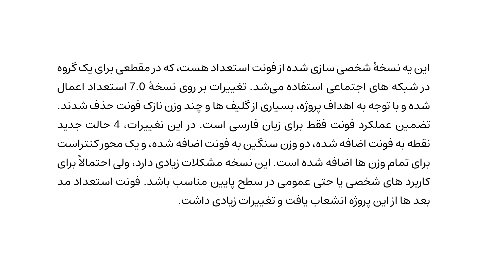
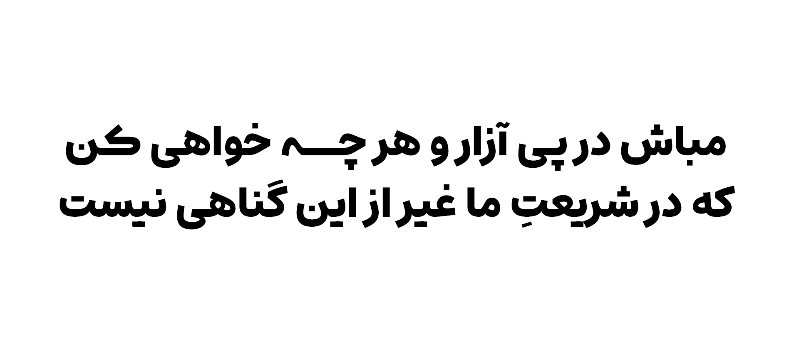
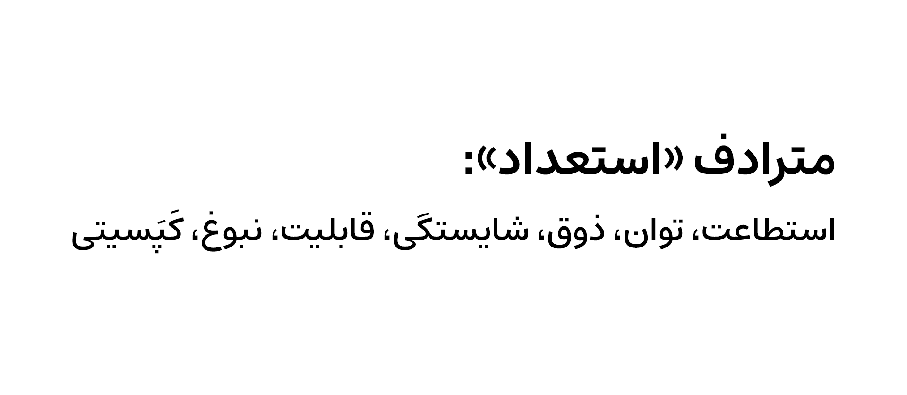
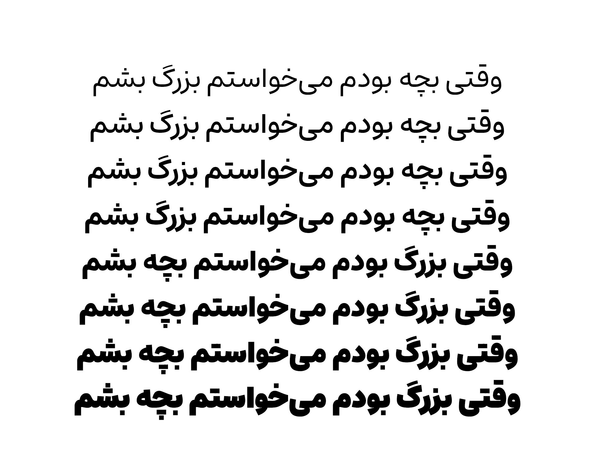
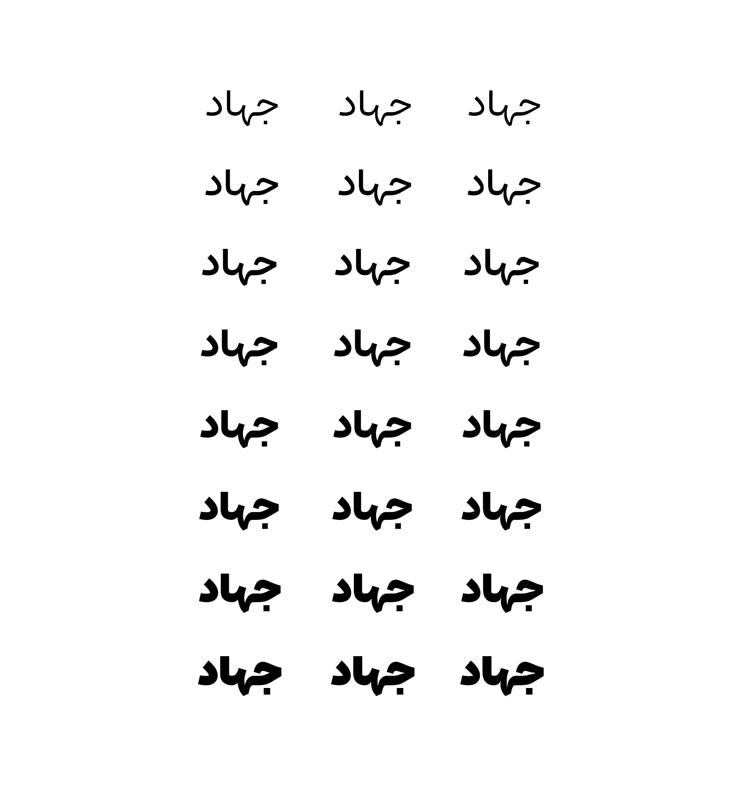
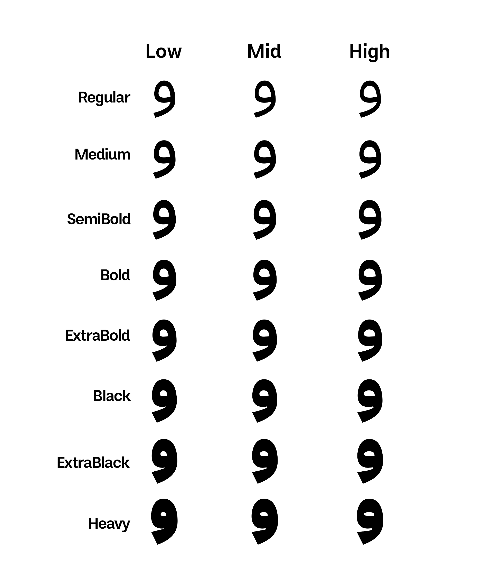
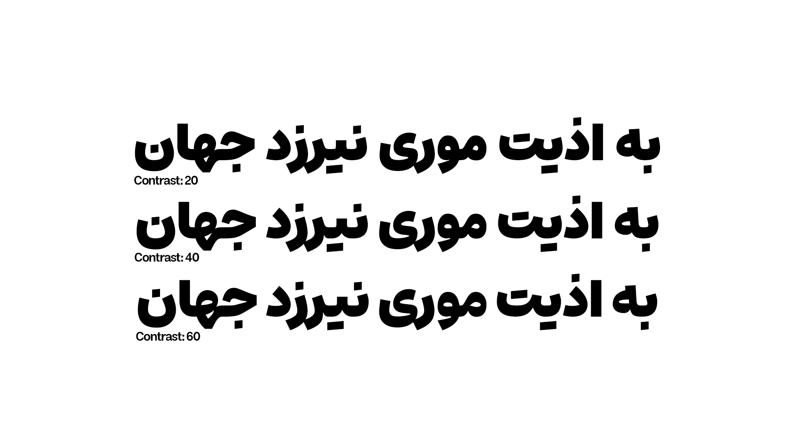
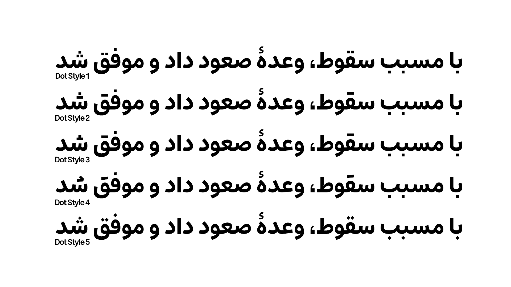
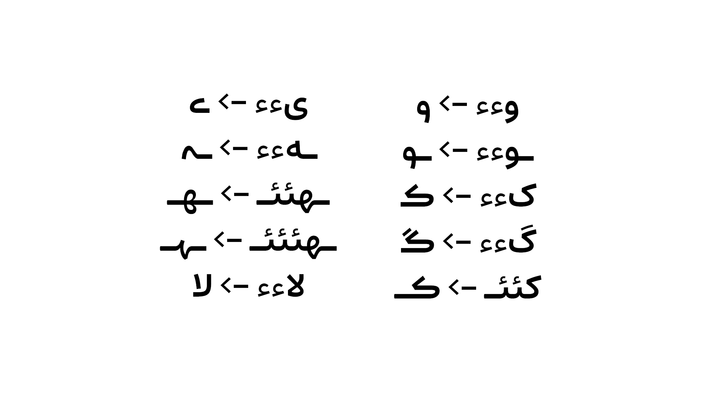

# Estedad-MDarvishi

این یه نسخۀ شخصی سازی شده از فونت استعداد هست، که در مقطعی برای یک گروه در شبکه های اجتماعی استفاده می‌شد. تغییرات بر روی نسخۀ 7.0 استعداد  اعمال شده و با توجه به اهداف پروژه، بسیاری از گلیف ها و چند وزن نازک فونت حذف شدند. تضمین عملکرد فونت فقط برای زبان فارسی است. در این نغییرات، 4 حالت جدید نقطه به فونت اضافه شده، دو وزن سنگین به فونت اضافه شده، و یک محور کنتراست برای تمام وزن ها اضافه شده است. این نسخه مشکلات زیادی دارد، ولی احتمالاً برای کاربرد های شخصی یا حتی عمومی در سطح پایین مناسب باشد. فونت <a href="https://github.com/MDarvishi5124/Estedad-Mad" >استعداد مد</a> بعد ها از این پروژه انشعاب یافت و تغییرات زیادی داشت.

## ترکیبات اختیاری
اینطور بنویسید تا بهش تبدیل بشه!

پروژه اصلی استعداد، لینک حمایت نداره، ولی شما برای **فقط حمایت از کار من** می‌تونید از لینک <a href="https://daramet.com/mdarvishi5124" >دارمت</a>  استفاده کنید.
